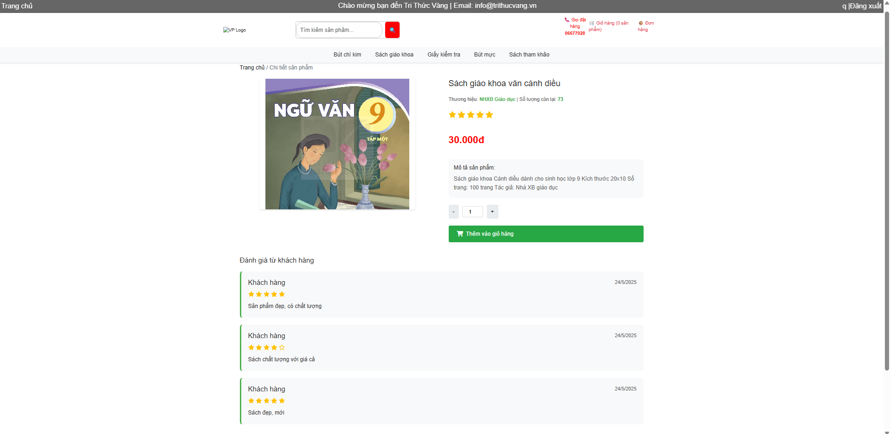
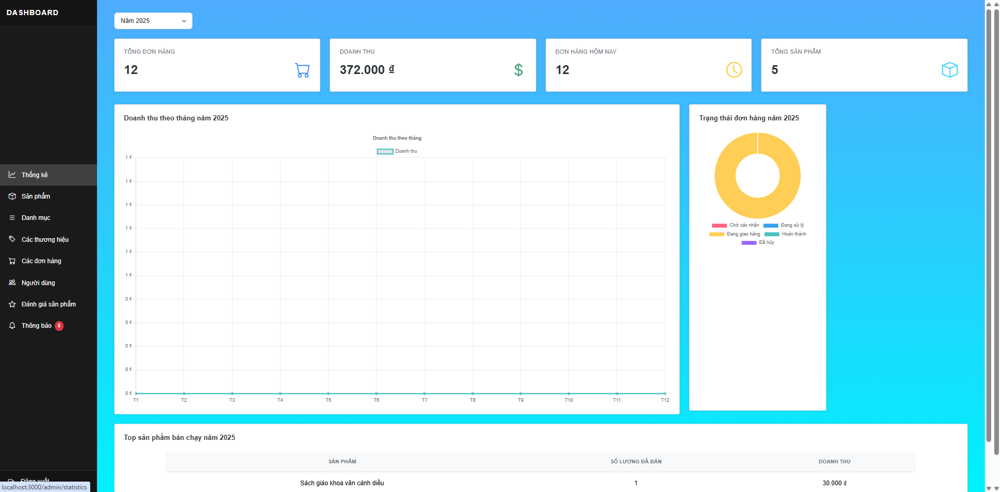
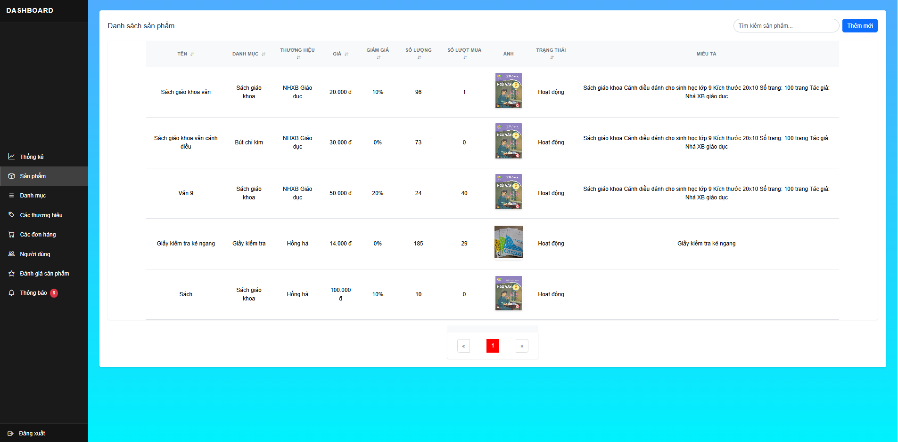

# Stationery E-commerce Platform

## Introduction
The Stationery E-commerce Platform is a comprehensive online marketplace designed for stationery products. This project provides a modern, user-friendly interface for customers to browse, purchase stationery items, and for administrators to manage inventory, orders, and user accounts.

## Demo









## Technology Stack

### Backend
- Spring boot 
- Websocket
- Rabbitmq
- Maven

### Frontend
- ReactJS
- Bootstrap

### Database
- Mysql
- Redis
- Elastic search

### Authentication
- Oauth Google
- JWT

### External
- VNPay
- Gemini
- API commune, district, province


## Project Structure
```
├── backend/
│   └── stationery/
│       ├── src/
│       ├── pom.xml
│       └── docker-compose.yml
└── frontend/
    ├── src/
    ├── public/
    └── package.json
```

## Contributing
1. Fork the repository
2. Create your feature branch (`git checkout -b feature/AmazingFeature`)
3. Commit your changes (`git commit -m 'Add some AmazingFeature'`)
4. Push to the branch (`git push origin feature/AmazingFeature`)
5. Open a Pull Request


